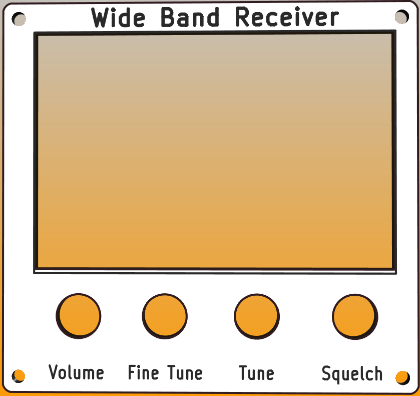
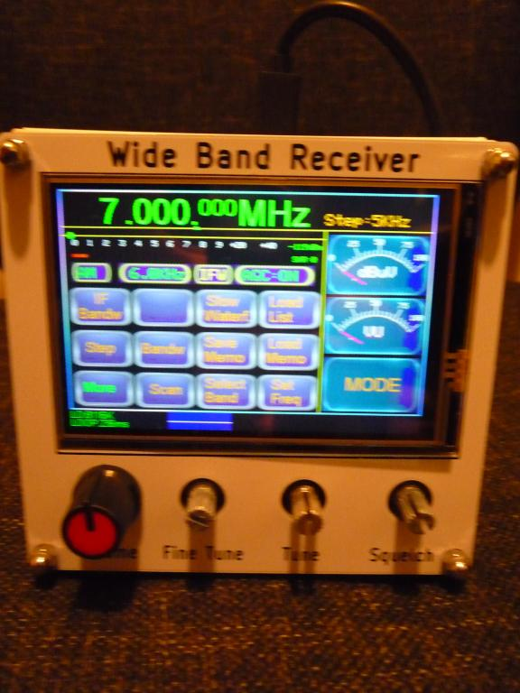
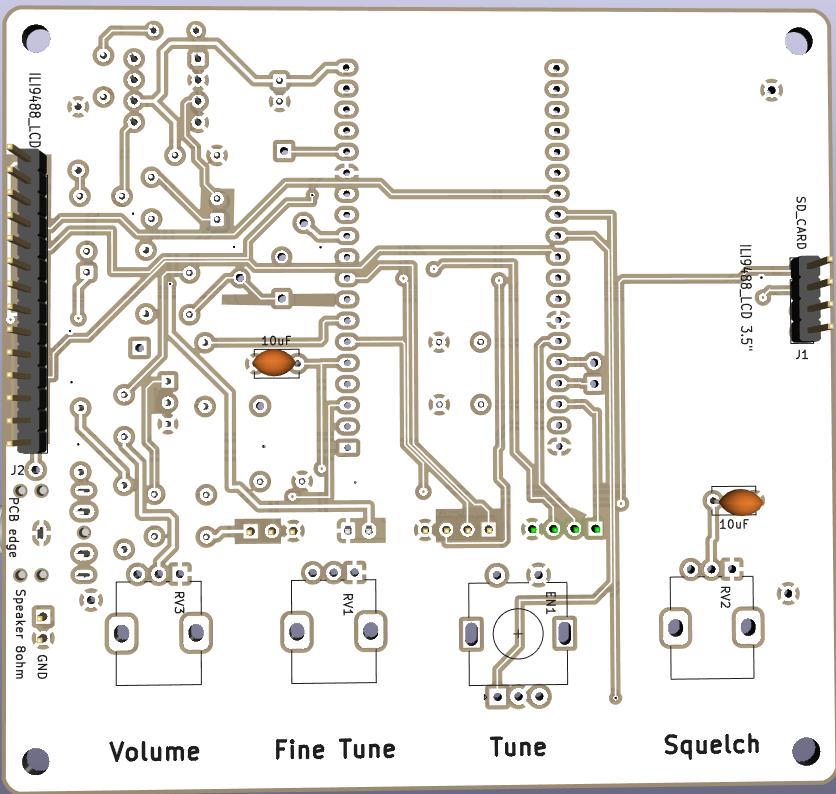
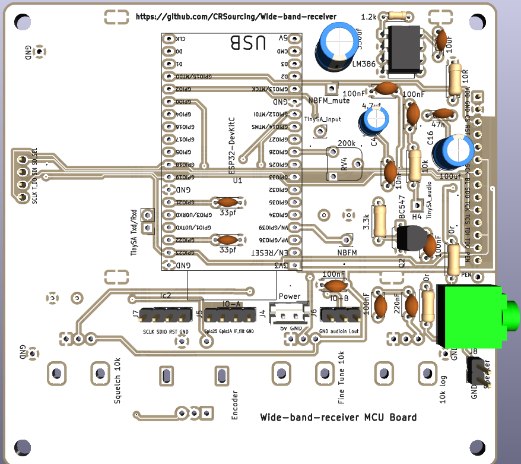
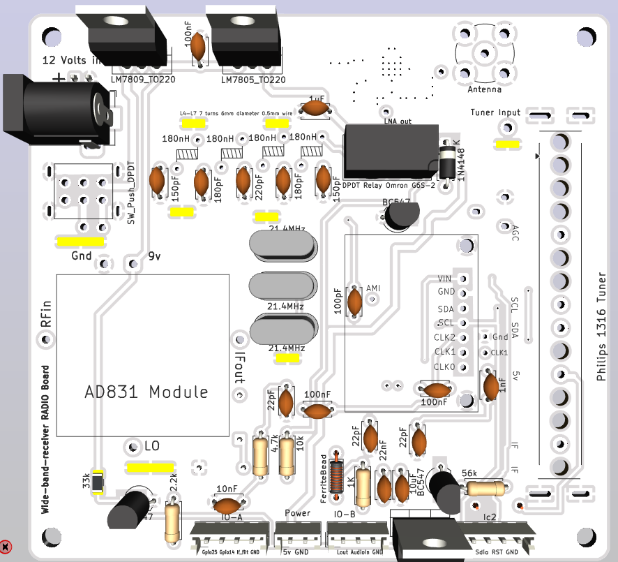
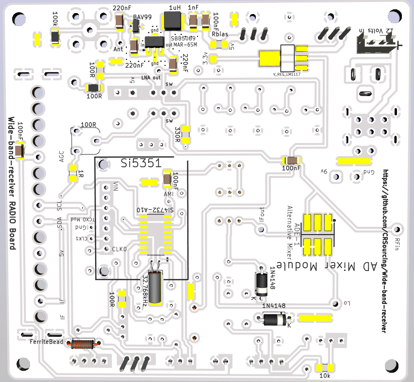
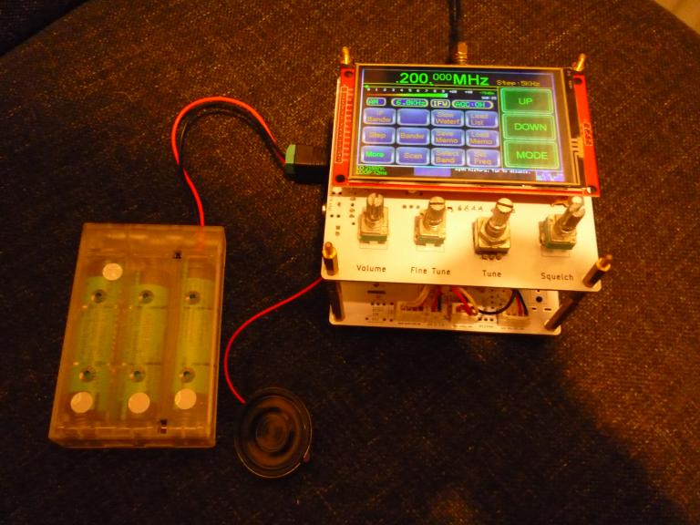
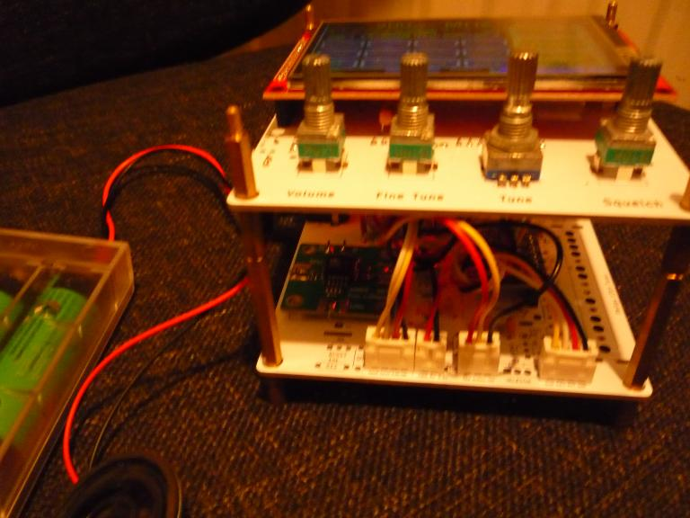
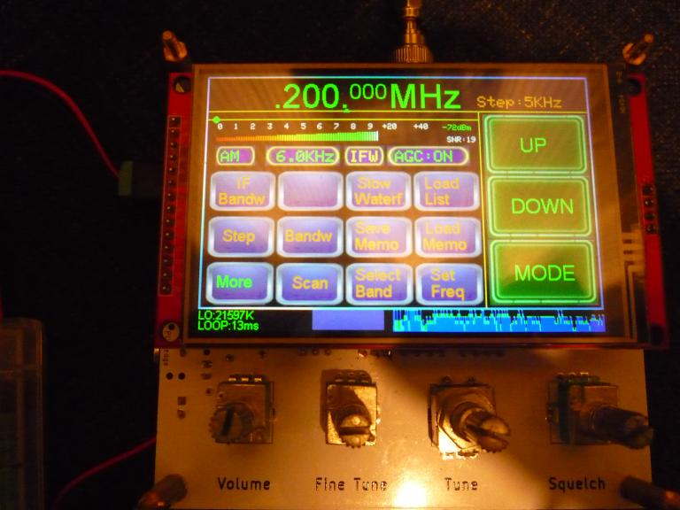

# Wide band receiver
Added prototype PCBs.

Front Bezel and MCU/Display PCB boards work well.
Radio PCB Board works but is in need of further testing and layout optimization.

    

    

    

    

    

    

    

    

    

